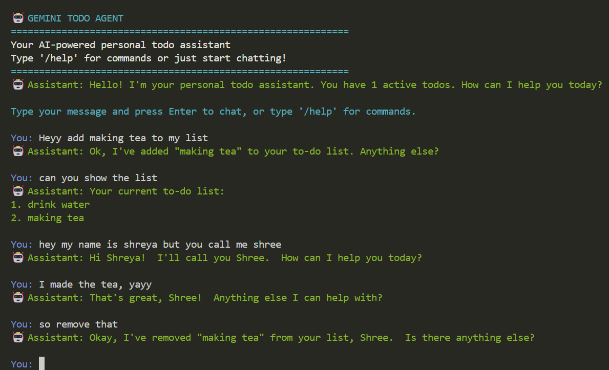
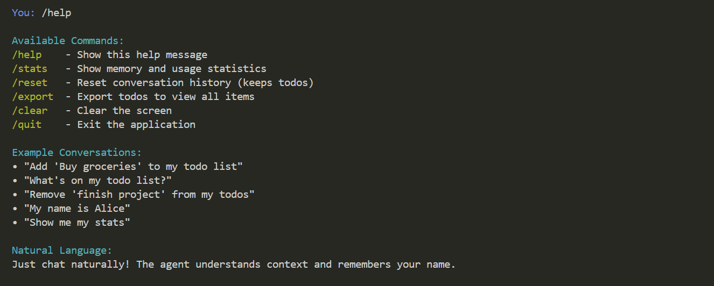

# Gemini Todo Agent

This is an AI-powered personal todo assistant built with Google's Gemini API and LangChain, featuring agentic architecture with memory persistence and natural language interactions.

## Architecture

```
┌─────────────────┐    ┌─────────────────┐    ┌─────────────────┐
│       CLI       │    │      Agent      │    │   Memory        │
│   Interface     │◄──►│   (LangChain)   │◄──►│   Manager       │
│   (cli.py)      │    │   (agent.py)    │    │  (memory.py)    │
└─────────────────┘    └─────────────────┘    └─────────────────┘
         │                       │                       │
         │                       ▼                       │
         │              ┌─────────────────┐              │
         │              │   Gemini LLM    │              │
         │              │   (llm.py)      │              │
         │              └─────────────────┘              │
         │                       │                       │
         │                       ▼                       │
         │              ┌─────────────────┐              │
         └─────────────►│     Tools       │◄─────────────┘
                        │   (tools.py)    │
                        └─────────────────┘
```

### Core Components

1. **Agent (agent.py)**: Main orchestrator using LangChain's ReAct agent pattern
2. **LLM (llm.py)**: Custom Gemini API wrapper for LangChain integration
3. **Memory (memory.py)**: Handles conversation history and todo persistence
4. **Tools (tools.py)**: LangChain tools for todo operations and user management
5. **CLI (cli.py)**: Command-line interface with colored output and commands

## 🧠 Memory Management

The system uses **file-based JSON storage** for persistence:

### Storage Structure
```json
{
  "conversation_history": [
    {
      "timestamp": "2024-01-15T10:30:00",
      "user": "Hi there",
      "assistant": "Hello! How can I help you today?"
    }
  ],
  "user_name": "Shreya",
  "todos": [
    {
      "id": 1,
      "task": "Buy groceries",
      "created_at": "2024-01-15T10:30:00",
      "completed": false
    }
  ],
  "created_at": "2024-01-15T10:30:00",
  "last_updated": "2024-01-15T10:30:00"
}
```

### Memory Features
- **Conversation History**: Stores last 50 exchanges for context
- **User Personalization**: Remembers user's name across sessions
- **Todo Persistence**: Maintains active and completed todos
- **Automatic Cleanup**: Prevents memory bloat with size limits

## 🛠️ Tool Registration

Tools are registered as LangChain tools with proper docstrings:

```python
@tool
def add_todo(task: str) -> str:
    """Add a new task to the user's to-do list."""
    return memory_manager.add_todo(task)

@tool
def list_todos() -> str:
    """List all active tasks in the user's to-do list."""
    return memory_manager.list_todos()

@tool
def remove_todo(task: str) -> str:
    """Remove a task from the user's to-do list."""
    return memory_manager.remove_todo(task)
```

### Available Tools
- `add_todo`: Add new tasks
- `list_todos`: Show active todos
- `remove_todo`: Remove/complete tasks
- `set_user_name`: Save user's name
- `get_user_name`: Retrieve user's name
- `get_memory_stats`: Show usage statistics


## Screenshots





## 🚀 Setup Instructions

### Prerequisites
- Python 3.8+
- [uv](https://github.com/astral-sh/uv) package manager
- Google AI Studio API key

### Installation

1. **Clone the repository**
```bash
git clone https://github.com/your-username/todo-agent.git
cd todo-agent
```

### Option 1: Using uv 
If you have uv installed:

#### Install dependencies using uv
uv sync

#### Activate the virtual environment
source .venv/bin/activate  # On Windows: .venv\Scripts\activate


### Option 2: Using pip and requirements.txt
If you don't have uv installed or don't wanna install:

#### Create a virtual environment
python -m venv venv

#### Activate the virtual environment
source venv/bin/activate  # On Windows: venv\Scripts\activate

#### Install dependencies
pip install -r requirements.txt

3. **Set up environment variables**
```bash
# Create .env file in the root directory
echo "GEMINI_API_KEY=your_api_key_here" > .env
```

4. **Run the application**
```bash
uv run -m src.todo.main
```

### Getting API Key
1. Go to [Google AI Studio](https://aistudio.google.com/)
2. Create a new API key
3. Copy the key to your `.env` file

## 💬 Usage Examples

### Basic Conversations
```
You: Hi there
🤖 Assistant: Hello! How can I help you today? I can manage your todos or just chat with you.

You: My name is Shreya
🤖 Assistant: Nice to meet you, Shreya! I'll remember your name.
```

### Todo Management
```
You: Add "Buy groceries" to my todo list
🤖 Assistant: Added 'Buy groceries' to your to-do list.

You: What's on my todo list?
🤖 Assistant: Your current to-do list:
1. Buy groceries

You: Remove "Buy groceries" from my todos
🤖 Assistant: Removed 'Buy groceries' from your to-do list.
```

### CLI Commands
```
/help    - Show available commands
/stats   - Display memory and usage statistics
/export  - View all todos (active and completed)
/reset   - Reset conversation history
/clear   - Clear screen
/quit    - Exit application
```

## 🎯 Features

- **Natural Language Processing**: Understands context and intent
- **Persistent Memory**: Remembers conversations and todos across sessions
- **User Personalization**: Stores and uses user's name
- **Duplicate Detection**: Prevents duplicate todos
- **Conversation Context**: Maintains context for natural interactions
- **Error Handling**: Graceful error recovery and user feedback
- **Colored CLI**: Enhanced user experience with colored output

## 🔧 Configuration

### Environment Variables
```bash
GEMINI_API_KEY=your_api_key_here
```

### Model Settings (config.py)
```python
MODEL_NAME = "gemini-1.5-flash"
TEMPERATURE = 0.3
MAX_HISTORY_LENGTH = 50
```

## 📝 Project Structure (Basic)

```
gemini-todo-agent/
├── src/
│   └── todo/
│       ├── __init__.py
│       ├── main.py          # Entry point
│       ├── agent.py         # Main agent logic
│       ├── llm.py           # Gemini API wrapper
│       ├── memory.py        # Memory management
│       ├── tools.py         # LangChain tools
│       ├── cli.py           # CLI interface
│       └── config.py        # Configuration
├── data/                    # Storage directory
│   └── memory.json         # Persistent memory
├── .env                    # Environment variables
├── README.md              # This file
├── requirements.txt        # Dependencies
└── pyproject.toml       # Dependencies (using uv)
```

## 🚧 Limitations & Future Improvements

### Current Limitations
- File-based storage (not suitable for high concurrency)
- Basic error handling for API failures
- Limited conversation context (last 50 exchanges)
- No todo categories or priorities
- No due dates or reminders

### Future Enhancements
- **Database Integration**: PostgreSQL or SQLite for better persistence
- **Web Interface**: React-based web UI
- **Todo Categories**: Organize todos by category
- **Due Dates**: Add scheduling capabilities
- **Search Functionality**: Search through todos and conversations
- **Export Options**: Export todos to various formats
- **Multi-user Support**: Support multiple users
- **Voice Integration**: Voice commands and responses
- **Calendar Integration**: Sync with calendar applications

## 🔍 Debugging

Enable verbose mode for debugging:
```python
# In agent.py
agent_executor = AgentExecutor(
    agent=agent,
    tools=self.tools,
    verbose=True,  # Enable for debugging
    ...
)
```

